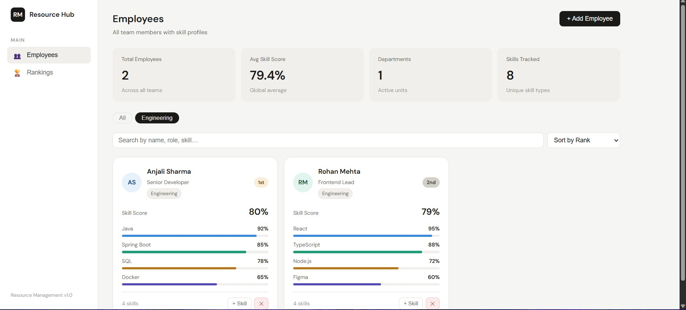

# 🏆 Resource Management System

<div align="center">

### *Track Skills. Rank Talent. Build Better Teams.*

[](https://www.java.com)
[](https://spring.io/projects/spring-boot)
[](https://www.mongodb.com/atlas)
[](https://reactjs.org)
[](LICENSE)

> An internal HR tool for tracking employee profiles, skill sets, and performance rankings — built with **Java Spring Boot + MongoDB Atlas + React**.

</div>

---

## 📸 Screenshots

### 🧑‍💼 Employee Dashboard



> All team members with skill profiles, real-time rankings, department filters, and search.

---

## ✨ Features

### 👥 Employee Management
- Add, update, and delete employee profiles
- Department-wise filtering with smart search
- Avatar color picker and auto-generated initials
- Employee status: `ACTIVE`, `INACTIVE`, `ON_LEAVE`

### 🎯 Skill Assignment (Java Backend)
- Assign skills with proficiency % (1–100) per employee
- AI-powered skill suggestions based on existing skills
- Live proficiency bar preview while assigning
- Update or remove skills with one click

### 📊 Smart Rankings
- Auto-rank employees by average skill score
- 🥇🥈🥉 medal badges for top 3
- Department-filtered leaderboard
- Mini progress bars with top skill display

### 📈 Dashboard & Analytics
- Bar chart — Average skill score by department
- Pie chart — Score distribution across employees
- Radar chart — Top skills by proficiency
- Top 5 employees leaderboard with score rings

### 🎨 Premium UI (v2.0)
- Click any card → Full employee profile modal
- Smooth hover animations (lift + shadow + scale)
- Dark / Light mode toggle
- Skeleton loading states
- Toast notifications (success / error)
- Gradient score rings and animated skill bars

---

## 🚀 Tech Stack

| Layer | Technology |
|-------|-----------|
| **Backend** | Java 17 + Spring Boot 3.2 |
| **Database** | MongoDB Atlas (Cloud) |
| **Frontend** | React 18 + React Router 6 |
| **Charts** | Recharts |
| **Icons** | Lucide React |
| **Fonts** | Sora + Inter |
| **Build** | Maven · npm |

---

## 📁 Project Structure

```
resource-management/
│
├── pom.xml
├── README.md
│
├── backend/src/main/
│   ├── resources/
│   │   └── application.properties       ← MongoDB Atlas URI
│   └── java/com/company/resourcemgmt/
│       ├── ResourceMgmtApplication.java
│       ├── config/
│       │   ├── CorsConfig.java
│       │   └── DataSeeder.java          ← Auto-seeds 8 sample employees
│       ├── controller/
│       │   ├── ResourceController.java  ← 17 REST endpoints
│       │   └── GlobalExceptionHandler.java
│       ├── dto/
│       │   ├── EmployeeDTO.java
│       │   ├── EmployeeRequest.java
│       │   ├── SkillRequest.java
│       │   ├── DashboardStatsDTO.java
│       │   └── ErrorResponse.java
│       ├── model/
│       │   ├── Employee.java            ← MongoDB @Document
│       │   └── EmployeeSkill.java       ← Embedded (no join collection)
│       ├── repository/
│       │   └── EmployeeRepository.java
│       └── service/
│           └── EmployeeService.java
│
└── frontend/src/
    ├── App.jsx
    ├── components/
    │   ├── MetricBar.jsx
    │   ├── EmployeeCard.jsx
    │   ├── EmployeeProfileModal.jsx
    │   ├── RankTable.jsx
    │   ├── AssignSkillModal.jsx
    │   └── AddEmployeeModal.jsx
    ├── pages/
    │   ├── EmployeesPage.jsx
    │   ├── RankingsPage.jsx
    │   └── DashboardPage.jsx
    └── services/
        └── api.js
```

---

## ⚡ Quick Start

### Step 1 — MongoDB Atlas Setup

1. Go to [https://cloud.mongodb.com](https://cloud.mongodb.com) → Create free **M0 cluster**
2. **Database Access** → Add user with `read/write` permissions
3. **Network Access** → Add IP `0.0.0.0/0`
4. **Connect** → Copy connection URI

### Step 2 — Configure

Edit `backend/src/main/resources/application.properties`:

```properties
spring.data.mongodb.uri=mongodb+srv://<username>:<password>@<cluster>.mongodb.net/resourcedb?retryWrites=true&w=majority
spring.data.mongodb.database=resourcedb
server.port=8080
```

### Step 3 — Run Backend

```bash
mvn spring-boot:run
# ✅ Starts at http://localhost:8080
# ✅ DataSeeder auto-inserts 8 sample employees on first run
```

### Step 4 — Run Frontend

```bash
cd frontend
npm install
npm start
# ✅ Starts at http://localhost:3000
```

---

## 🔌 API Reference

| Method | Endpoint | Description |
|--------|----------|-------------|
| `GET` | `/api/employees` | All employees |
| `GET` | `/api/employees/{id}` | One employee |
| `POST` | `/api/employees` | Create employee |
| `PUT` | `/api/employees/{id}` | Update employee |
| `DELETE` | `/api/employees/{id}` | Delete employee |
| `GET` | `/api/employees/ranked` | Ranked by skill score |
| `GET` | `/api/employees/top?n=5` | Top N employees |
| `POST` | `/api/employees/{id}/skills` | Assign or update skill |
| `DELETE` | `/api/employees/{empId}/skills/{skillId}` | Remove skill |
| `GET` | `/api/employees/search?q=java` | Search |
| `GET` | `/api/employees/department/{dept}` | Filter by dept |
| `GET` | `/api/employees/by-skill?name=Java` | Filter by skill |
| `GET` | `/api/dashboard` | Summary stats + charts data |

---

## 🍃 MongoDB Document Structure

```json
{
  "_id": "ObjectId(abc123...)",
  "name": "Anjali Sharma",
  "role": "Senior Developer",
  "department": "Engineering",
  "email": "anjali@company.com",
  "avatarInitials": "AS",
  "avatarColor": "av-blue",
  "status": "ACTIVE",
  "skills": [
    { "id": "uuid-1", "skillName": "Java",        "category": "Backend", "proficiency": 92 },
    { "id": "uuid-2", "skillName": "Spring Boot", "category": "Backend", "proficiency": 85 },
    { "id": "uuid-3", "skillName": "SQL",         "category": "Data",    "proficiency": 78 },
    { "id": "uuid-4", "skillName": "Docker",      "category": "DevOps",  "proficiency": 65 }
  ]
}
```

> **Skill Score** = `(92 + 85 + 78 + 65) / 4 = 80%`

---

## 📄 License

MIT License — free to use and modify.

---

<div align="center">
Built with <strong>Java Spring Boot</strong> + <strong>MongoDB Atlas</strong> + <strong>React</strong>
</div>
